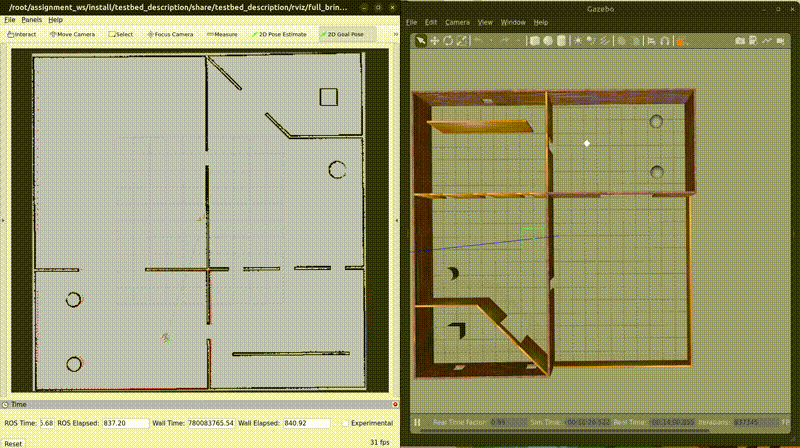
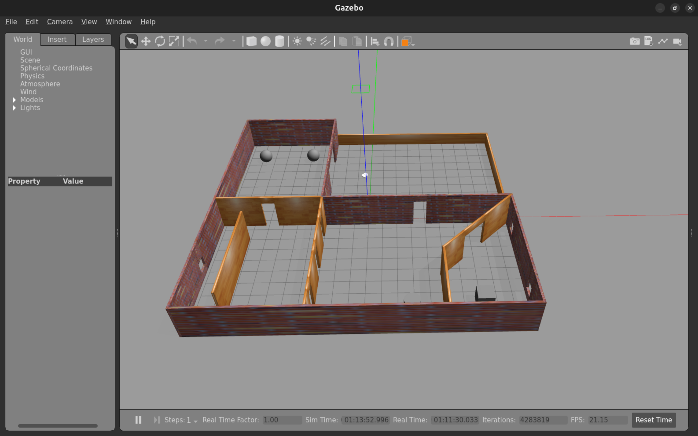
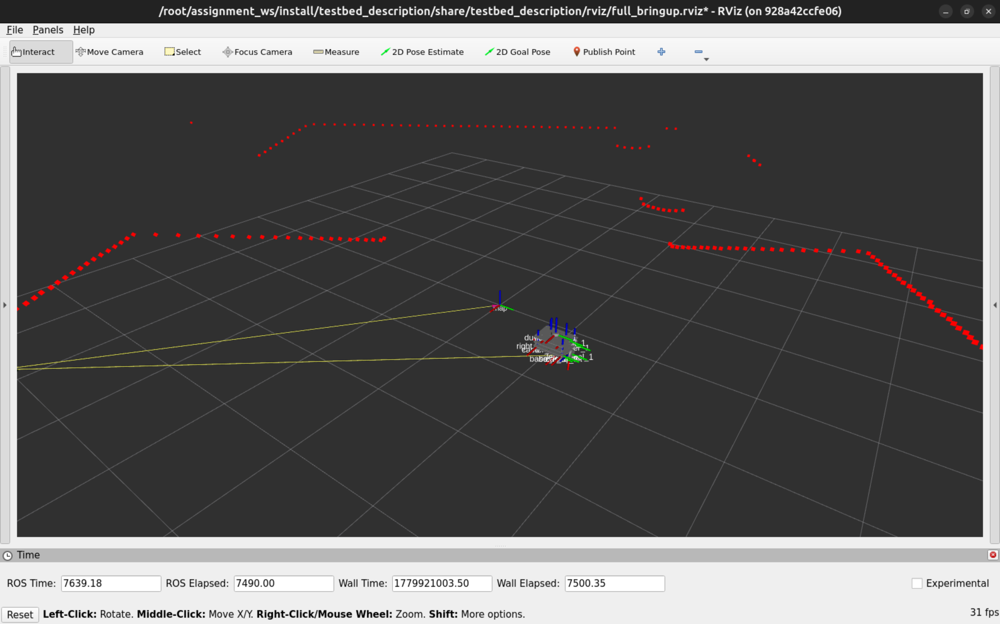
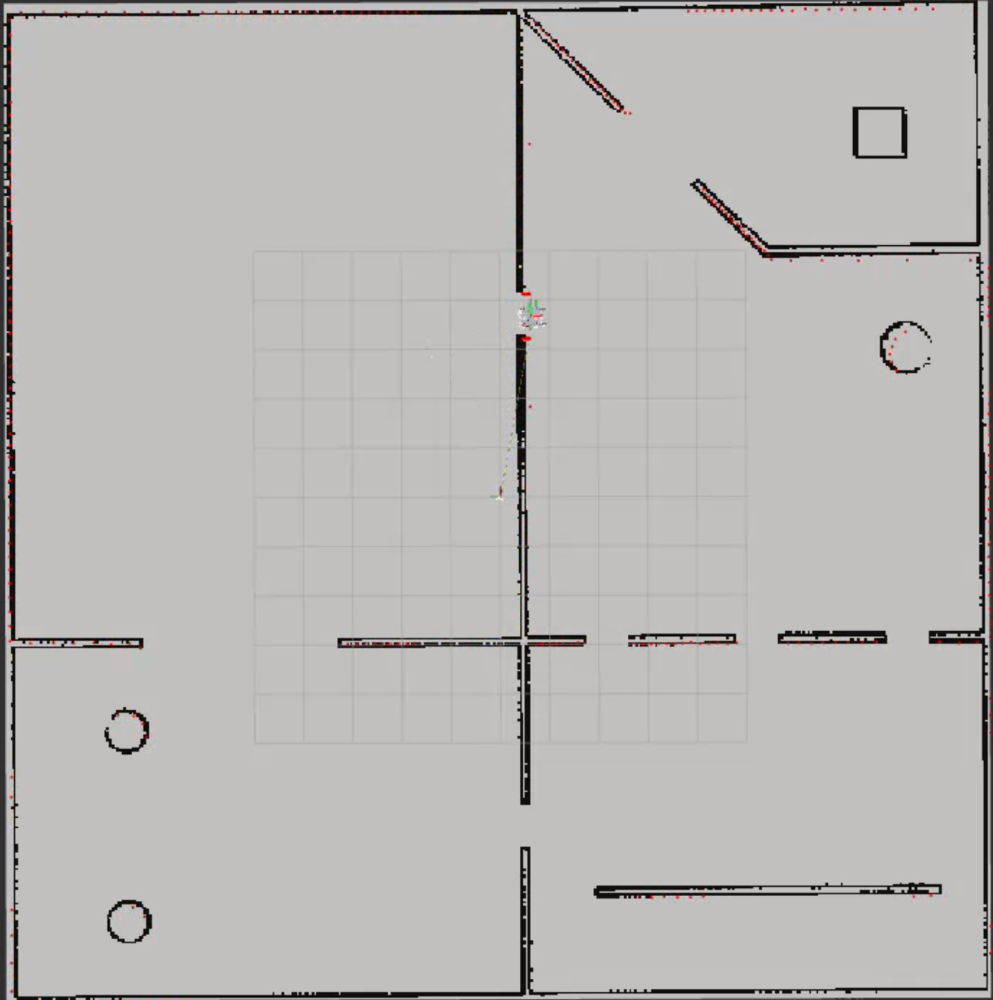

# ros2-autonomous-navigation

A modular autonomous navigation stack for a differential drive robot, built on ROS2 Humble and the Nav2 framework. The package implements the full navigation pipeline — map loading, localization, and path planning — using individual, independently configurable launch files rather than a single monolithic bringup.

---

## Full Navigation Demo



---

## Screenshots

### Simulation Environment (Gazebo)


### Robot with Laser Scan in RViz


### Map Loaded in RViz


---

## Robot

The **Testbed-T1.0.0** is a differential drive robot featuring:
- 2D LiDAR for environment sensing
- Differential drive locomotion with wheel odometry
- Full Gazebo Classic 11 simulation support
- RViz visualization integration

---

## Repository Structure

```
ros2-autonomous-navigation/
├── testbed_navigation/          # Core navigation package
│   ├── config/
│   │   ├── amcl_params.yaml     # AMCL localization parameters
│   │   └── nav2_params.yaml     # Full Nav2 stack configuration
│   ├── launch/
│   │   ├── map_loader.launch.py
│   │   ├── localization.launch.py
│   │   └── navigation.launch.py
│   ├── CMakeLists.txt
│   └── package.xml
├── testbed_bringup/             # Simulation bringup and maps
├── testbed_description/         # Robot URDF and meshes
├── testbed_gazebo/              # Gazebo world and models
├── Project_highlights/          # Screenshots and demo GIF
└── README.md
```

---

## Nav2 Plugins Used

| Plugin | Role |
|--------|------|
| `nav2_map_server` | Loads and serves the occupancy grid map |
| `nav2_amcl` | Particle filter localization using laser scan data |
| `nav2_navfn_planner` | Global path planning via Dijkstra/A* |
| `dwb_core::DWBLocalPlanner` | Local planner for real-time obstacle avoidance |
| `nav2_bt_navigator` | Behavior Tree based navigation orchestration |
| `nav2_behaviors` | Recovery behaviors when the robot gets stuck |
| `nav2_lifecycle_manager` | Manages lifecycle transitions of all Nav2 nodes |

---

## Dependencies

- ROS2 Humble
- Gazebo Classic 11.10.2
- ros-humble-navigation2
- ros-humble-nav2-bringup
- ros-humble-gazebo-ros-pkgs
- ros-humble-xacro
- ros-humble-robot-state-publisher

---

## Installation

```bash
mkdir -p ~/ros2_ws/src
cd ~/ros2_ws/src
git clone git@github.com:Abhishek1010006/ros2-autonomous-navigation.git .

sudo apt update
sudo apt install ros-humble-navigation2 ros-humble-nav2-bringup ros-humble-gazebo-ros-pkgs -y

cd ~/ros2_ws
colcon build
source install/setup.bash
```

---

## Usage

### Step 1 — Launch the Simulation

```bash
ros2 launch testbed_bringup testbed_full_bringup.launch.py
```

Wait for Gazebo and RViz to fully open before proceeding.

### Step 2 — Launch Navigation Stack

Open a new terminal:

```bash
source install/setup.bash
ros2 launch testbed_navigation navigation.launch.py
```

Wait until the terminal prints:

```
[lifecycle_manager_navigation]: Managed nodes are active
```

### Step 3 — Set Initial Pose in RViz

In RViz, change the Fixed Frame to `map`. Click **2D Pose Estimate** in the toolbar, click on the robot's location on the map, and drag to set the heading direction.

### Step 4 — Send a Navigation Goal

Click **2D Goal Pose** in the RViz toolbar, click a destination on the map, and drag to set the goal direction. The robot will plan a path and navigate autonomously.

---

## Running Components Individually

```bash
# Load map only
ros2 launch testbed_navigation map_loader.launch.py

# Run localization only (requires map_loader running first)
ros2 launch testbed_navigation localization.launch.py

# Run full navigation stack
ros2 launch testbed_navigation navigation.launch.py
```

---

## Configuration

### AMCL Parameters

| Parameter | Value | Description |
|-----------|-------|-------------|
| min_particles | 500 | Minimum particle count |
| max_particles | 2000 | Maximum particle count |
| laser_model_type | likelihood_field | Laser sensor model |
| robot_model_type | DifferentialMotionModel | Robot motion model |
| update_min_d | 0.25 m | Minimum travel distance before filter update |
| update_min_a | 0.2 rad | Minimum rotation before filter update |

### Navigation Parameters

| Parameter | Value | Description |
|-----------|-------|-------------|
| max_vel_x | 0.26 m/s | Maximum linear velocity |
| max_vel_theta | 1.0 rad/s | Maximum angular velocity |
| robot_radius | 0.22 m | Robot footprint radius |
| inflation_radius | 0.55 m | Costmap obstacle inflation |
| sim_time | 1.7 s | DWB trajectory simulation time |

---

## Coordinate Frames

```
map --> odom --> base_footprint --> base_link --> lidar_link_1
```

The `map → odom` transform is published by AMCL. The `odom → base_footprint` transform is published by the differential drive controller in Gazebo.

---

## Known Issues

- The robot requires a valid initial pose via 2D Pose Estimate before accepting navigation goals.
- A libgazebo_ros_control warning appears on Gazebo startup — this does not affect navigation functionality.
- Navigation is tested only in the provided testbed_playground.world environment.

---

## Contact

- **Name:** Abhishek Kumar Singh
- **Email:** abhishekkumarsngh000@gmail.com
- **Phone:** +91 6202174621
